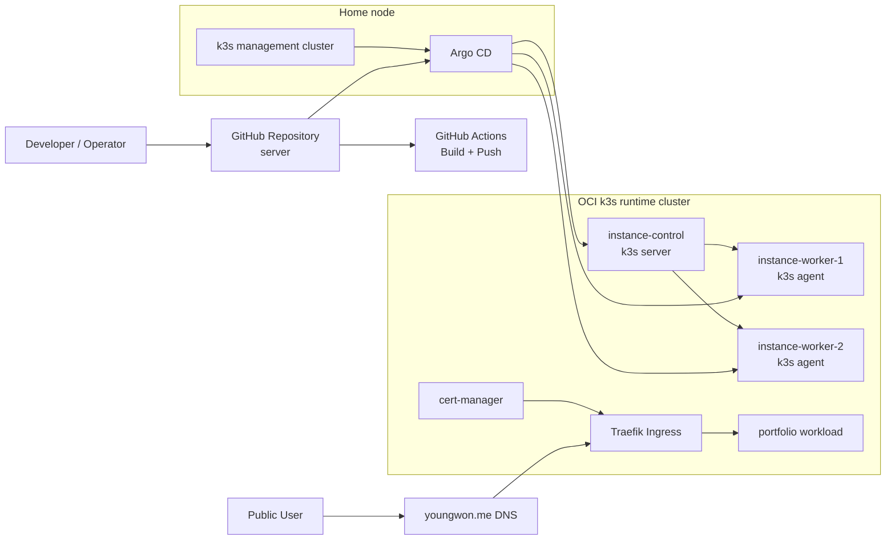

# server
Everything About my GitOps & Oracle Cloud Server Setting


Home node의 Argo CD 관리 클러스터와 OCI k3s 런타임 클러스터로 전환한 상태를 관리한다.

- 설계 문서: `docs/k3s-argocd-migration-design.md`
- OCI 적용 가이드: `docs/oci-k3s-apply-guide.md`
- Argo CD bootstrap: `bootstrap/home-mgmt/`
- Argo CD application/app-of-apps: `argocd/`
- OCI 공통 플랫폼: `clusters/oci-prod/`
- 서비스별 앱 배포 선언: `apps/`

## Apply To OCI

상세 절차는 `docs/oci-k3s-apply-guide.md`를 보면 된다.

핵심 순서는 다음과 같다.

1. OCI `instance-control`, `instance-worker-1`, `instance-worker-2`에 k3s cluster를 구성한다.
2. Home node에 management k3s와 Argo CD를 설치한다.
3. Home node의 Argo CD에 OCI cluster를 `oci-prod`로 등록한다.
4. root app을 적용해 `cert-manager`와 애플리케이션을 GitOps로 배포한다.
5. `youngwon.me` DNS를 OCI ingress public IP로 전환한다.

주의:

- `instance-control`에서는 `server` 설치만 실행한다.
- `instance-worker-1`, `instance-worker-2`에서만 `K3S_URL=...` join 명령을 실행한다.
- `--node-ip`는 현재 로그인한 노드의 private IP와 정확히 일치해야 한다.

빠른 시작 명령:

```bash
kubectl apply --server-side --force-conflicts -k bootstrap/home-mgmt/argocd-install
argocd cluster add <kube-context> --name oci-prod
kubectl apply -k bootstrap/home-mgmt/root-app
```

## Portfolio Deployment

`portfolio`는 Docker Hub 이미지 `yw7148/portfolio`로 배포한다.

- base manifests: `apps/portfolio/base/`
- production overlay: `apps/portfolio/overlays/prod/`
- prod ingress host/path: `youngwon.me/portfolio`
- 기본 태그 승격 workflow: `.github/workflows/promote-portfolio-image.yml`

## Multi-Service Structure

현재 구조는 `portfolio` 한 개만 들어가 있지만, 여러 서비스를 추가할 수 있게 나눠져 있다.

- 서비스별 매니페스트: `apps/<service>/base/`
- 환경별 오버레이: `apps/<service>/overlays/prod/`
- Argo CD 앱 선언: `argocd/applications/<service>-prod.yaml`
- 서비스별 namespace: `clusters/oci-prod/namespaces/<service>.yaml`

예시는 `apps/README.md`에 정리해두었다.

민감한 값 주의:

- 실제 `K3S_TOKEN`, Argo CD 비밀번호, kubeconfig, 운영용 공인 IP는 문서에 하드코딩하지 않는다.
- 설치 예시는 항상 `<NODE_TOKEN>`, `<OCI_CONTROL_PUBLIC_IP>`, `<ARGOCD_ADMIN_PASSWORD>` 같은 placeholder를 사용한다.
