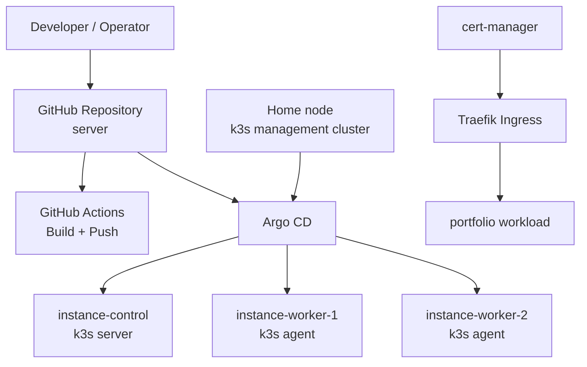

# k3s / Argo CD Migration Design

## Summary

이 문서는 현재 `Jenkins` + `Nginx` 중심 운영 구조를 `Home node`의 Argo CD 관리 클러스터와 `OCI`의 k3s 런타임 클러스터로 전환하기 위한 기준 설계 문서다.

최종 목표는 다음과 같다.

- Home node에 단일 노드 k3s management cluster를 두고 Argo CD를 설치한다.
- OCI의 `instance-control` 1대와 `instance-worker-1`, `instance-worker-2` 2대로 k3s workload cluster를 구성한다.
- 외부 노출은 OCI k3s의 Traefik ingress를 사용한다.
- TLS는 `cert-manager`와 ACME를 사용해 자동화한다.
- CI는 GitHub Actions로, CD는 Argo CD GitOps로 분리한다.
- 기존 `youngwon.me/portfolio` 경로는 초기 마이그레이션 동안 그대로 유지한다.

## Current State

현재 리포와 Terraform 기준으로 운영 상태는 다음과 같다.

- Home node
  - Jenkins가 Docker socket 바인딩 기반으로 로컬 컨테이너에서 동작한다.
- OCI
  - `instance-control`
  - `instance-worker-1`
  - `instance-worker-2`
  - 세 인스턴스 모두 같은 OCI subnet에 있으며 public IP가 할당되어 있다.
- Public edge
  - Nginx가 `youngwon.me`의 TLS 종료를 수행한다.
  - `/portfolio` 요청은 OCI의 별도 public endpoint `:9001`로 프록시된다.

현재 구조의 한계는 다음과 같다.

- Jenkins가 Home node의 Docker 환경에 강하게 결합되어 있다.
- Nginx와 실제 애플리케이션 런타임이 분리되어 있어 경로, 인증서, 백엔드 주소를 수동으로 맞춰야 한다.
- 배포 선언이 GitOps 형태로 정리되어 있지 않아 변경 이력과 목표 상태 추적이 어렵다.
- OCI 노드가 있어도 클러스터 관점의 일관된 운영 모델이 없다.

## Goals

- Argo CD를 중심으로 원하는 상태를 Git에 선언하고 자동 동기화한다.
- OCI 3노드를 하나의 k3s 클러스터로 운영한다.
- Home node는 관리 plane, OCI는 workload plane으로 역할을 분리한다.
- 기존 도메인과 서비스 경로를 크게 바꾸지 않고 무중단에 가깝게 전환한다.
- Jenkins 제거 이후에도 이미지 빌드부터 배포까지의 경로가 끊기지 않게 한다.

## Non-Goals

- 이번 설계는 multi-control-plane HA k3s까지 다루지 않는다.
- OCI Load Balancer 신규 도입은 이번 기본안에 포함하지 않는다.
- Secret manager 신규 도입은 이번 기본안에 포함하지 않는다.
- 모든 애플리케이션의 동시 이전은 목표가 아니다. 우선순위는 `portfolio`다.

## Final Decisions

- Argo CD는 Home node의 단일 노드 k3s management cluster 위에 둔다.
- OCI k3s cluster는 `instance-control` 1대의 control plane과 `instance-worker-1`, `instance-worker-2` 2대의 worker로 구성한다.
- 일반 애플리케이션 workload는 기본적으로 두 worker에 배치하고, `instance-control`은 control plane 역할을 우선한다.
- 이 `server` 리포를 GitOps source of truth로 사용한다.
- 외부 ingress는 k3s 기본 Traefik를 사용한다.
- TLS 발급과 갱신은 `cert-manager` + Let's Encrypt 기준으로 설계한다.
- Jenkins 대체 CI는 GitHub Actions로 한다.
- Argo CD UI는 기본적으로 public exposure 없이 private access를 원칙으로 한다.

## Target Architecture



## Node Roles

### Home node

- 단일 노드 k3s management cluster를 운영한다.
- Argo CD를 `argocd` namespace에 설치한다.
- OCI workload cluster를 remote cluster로 등록해 GitOps 컨트롤러 역할만 수행한다.
- 외부 서비스 트래픽의 public edge 역할은 맡지 않는다.

### OCI `instance-control`

- k3s server 역할을 맡는다.
- Kubernetes API endpoint의 기준 노드가 된다.
- 운영 원칙상 control plane 역할이 우선이며, 일반 workload는 가급적 worker에 배치한다.

현재 Terraform 기준 사양:

- Shape: `VM.Standard.A1.Flex`
- OCPU: `1`
- Memory: `6GB`
- Private IP: `10.0.0.195`

### OCI `instance-worker-1`

- k3s agent 역할을 맡는다.
- 일반 application workload의 기본 배치 대상이다.

현재 Terraform 기준 사양:

- Shape: `VM.Standard.A1.Flex`
- OCPU: `2`
- Memory: `9GB`
- Private IP: `10.0.0.149`

### OCI `instance-worker-2`

- k3s agent 역할을 맡는다.
- 일반 application workload의 두 번째 배치 대상이다.

현재 Terraform 기준 사양:

- Shape: `VM.Standard.A1.Flex`
- OCPU: `1`
- Memory: `9GB`
- Private IP: `10.0.0.81`

## Networking, DNS, and Security

### Traffic Model

- 외부 사용자 요청은 `youngwon.me`를 통해 OCI k3s ingress로 직접 유입된다.
- 초기 기본안은 DNS를 `instance-control`의 public IP로 연결한다.
- 이후 필요 시 다중 A record 또는 OCI Load Balancer로 확장할 수 있다.
- `/portfolio` 경로는 Traefik ingress rule로 유지한다.

### TLS

- `cert-manager`가 Let's Encrypt certificate를 발급한다.
- `youngwon.me` 인증서는 Kubernetes secret으로 관리된다.
- HTTP-01 challenge를 기본값으로 두고 ingress class는 `traefik`를 사용한다.

### Required Ports

- Internet -> OCI ingress
  - `80/tcp`
  - `443/tcp`
- Home node -> OCI control plane
  - `6443/tcp`
- OCI node internal communication
  - k3s overlay 및 agent/server 통신에 필요한 내부 포트 허용
- Admin access
  - `22/tcp`는 운영자 IP 범위로 제한

### Argo CD Access

- Argo CD UI는 public exposure를 하지 않는다.
- 접속은 Home node에서 직접 접근하거나 SSH tunnel 같은 private path를 사용한다.

## GitOps Repository Model

이 리포는 문서, 플랫폼 선언, 애플리케이션 선언을 같이 관리하는 단일 source of truth가 된다.

예상 구조:

```text
docs/
bootstrap/
  home-mgmt/
argocd/
  projects/
  applications/
clusters/
  oci-prod/
apps/
  portfolio/
.github/
  workflows/
```

역할 분리는 다음과 같다.

- `docs/`
  - 아키텍처, 운영 규칙, 마이그레이션 문서
- `bootstrap/home-mgmt/`
  - Home management cluster 초기 설치용 자산
- `argocd/projects/`
  - Argo CD AppProject
- `argocd/applications/`
  - OCI cluster에 배포할 child application
- `clusters/oci-prod/`
  - namespace, cluster issuer, 공통 platform manifest
- `apps/portfolio/`
  - `portfolio` 배포 선언
- `.github/workflows/`
  - 이미지 빌드, 푸시, 배포용 manifest promotion workflow

## CI/CD Operating Model

### CI

- GitHub Actions가 애플리케이션 이미지를 빌드한다.
- 빌드된 이미지는 Docker Hub `yw7148` namespace로 push한다.
- 이미지 태그는 immutable tag를 사용한다.
- 기본안은 Git SHA 또는 release tag 기반 tag를 사용한다.

### CD

- GitHub Actions는 배포 대상 manifest의 이미지 태그를 업데이트한다.
- Argo CD는 Git 변경을 감지해 OCI cluster와 동기화한다.
- v1에서는 Argo CD Image Updater 대신 GitHub Actions가 manifest promotion을 수행한다.

이 방식의 장점은 다음과 같다.

- 빌드 책임과 배포 책임이 분리된다.
- 실제 배포 상태가 항상 Git에 남는다.
- Jenkins의 Docker socket 의존성을 제거할 수 있다.

## Bootstrap Sequence

### 1. OCI Infrastructure Verification

- `/home/youngwon/terraform` 리포 기준으로 `instance-control`, `instance-worker-1`, `instance-worker-2`가 정상 상태인지 확인한다.
- 세 노드 모두 SSH 접근과 내부 네트워크 통신이 가능한지 확인한다.

### 2. Home Management Cluster Bootstrap

- Home node에 k3s single-node cluster를 설치한다.
- Argo CD를 설치한다.
- Argo CD admin 초기 접근 경로와 비밀번호 변경 절차를 설정한다.

### 3. OCI Workload Cluster Bootstrap

- `instance-control`에 k3s server를 설치한다.
- `instance-worker-1`, `instance-worker-2`를 k3s agent로 join한다.
- control plane 노드에는 운영 원칙상 일반 workload를 최대한 배치하지 않도록 taint 또는 scheduling rule을 적용한다.

### 4. Cluster Registration

- Home node의 Argo CD에서 OCI cluster를 remote cluster로 등록한다.
- cluster name은 `oci-prod`를 기본값으로 사용한다.

### 5. Base Platform Installation

- OCI cluster에 아래 공통 자산을 배포한다.
  - namespace
  - `cert-manager`
  - `ClusterIssuer`
  - 공통 ingress policy

### 6. First Workload Onboarding

- `portfolio`를 첫 번째 GitOps-managed workload로 등록한다.
- `/portfolio` 경로와 TLS가 정상 동작하는지 확인한다.

## Portfolio Migration Plan

### Before Cutover

- 현재 Nginx가 프록시하는 `portfolio` backend의 동작 포트와 health check 경로를 확인한다.
- OCI k3s cluster에 동일 이미지를 배포해 병렬 검증한다.
- Traefik ingress로 `/portfolio`가 서비스 가능한지 먼저 검증한다.

### Cutover

- `youngwon.me/portfolio`의 실제 ingress를 OCI k3s로 전환한다.
- 기존 Nginx 설정과 새 ingress를 일정 시간 병행 검증한다.
- 응답 코드, 정적 리소스 경로, HTTPS 동작을 확인한다.

### After Cutover

- 일정 기간 관찰 후 기존 Nginx의 `/portfolio` 프록시를 제거한다.
- Jenkins가 더 이상 배포 경로에 필요 없음을 확인한 뒤 종료한다.

## Rollback Plan

### Rollback Point 1

- Home node management cluster 구축 전 단계
- 이 시점에서는 기존 Jenkins/Nginx 운영을 그대로 유지한다.

### Rollback Point 2

- OCI k3s cluster bootstrap 완료 후
- 아직 public cutover 전이면 ingress만 비활성화하고 기존 경로를 유지한다.

### Rollback Point 3

- `portfolio` cutover 직후
- 문제가 있으면 DNS 또는 ingress route를 기존 Nginx 경로로 즉시 되돌린다.

### Rollback Point 4

- Jenkins/Nginx 종료 직전
- 최소 1회 이상 정상 배포와 재배포를 GitHub Actions + Argo CD로 검증한 뒤에만 종료한다.

## Operational Rules

- Argo CD는 운영 기준 source of truth가 Git임을 전제로 한다.
- emergency hotfix도 가능하면 Git을 통해 반영한다.
- cluster 안에서 수동 변경이 발생하면 반드시 Git 선언으로 되돌려 정합성을 맞춘다.
- Home node와 OCI의 책임을 섞지 않는다.
  - Home node는 management
  - OCI는 runtime

## Risks and Mitigations

### Single Control Plane

위험:

- `instance-control` 장애 시 Kubernetes API 운영성이 떨어진다.

대응:

- 이번 단계에서는 단순성을 우선하고 single control plane을 유지한다.
- 이후 필요 시 multi-server k3s 또는 외부 datastore 구성을 검토한다.

### Public Ingress Direct to OCI

위험:

- 초기에는 OCI Load Balancer 없이 단일 ingress 진입점에 의존한다.

대응:

- 먼저 구조 단순화를 우선한다.
- 서비스 증가 시 다중 A record 또는 OCI LB를 도입한다.

### Secret Management

위험:

- 초기 bootstrap에서 수동 secret 관리가 남을 수 있다.

대응:

- Git에는 secret을 저장하지 않는다.
- 추후 SOPS 또는 Sealed Secrets 도입을 후속 과제로 둔다.

## Acceptance Criteria

아래 조건을 만족하면 이번 전환 설계가 유효한 것으로 본다.

- 운영자가 Argo CD, OCI k3s, GitHub Actions의 역할 경계를 한 번에 설명할 수 있다.
- Home node와 OCI node 각각에 무엇이 올라가는지 모호하지 않다.
- `youngwon.me/portfolio`를 어떤 순서로 옮길지 절차가 분명하다.
- Jenkins 종료 전 필요한 검증 단계가 정의되어 있다.
- rollback 시점과 기준이 명확하다.

## Assumptions

- OCI 런타임 클러스터의 최종 노드는 `instance-control`, `instance-worker-1`, `instance-worker-2`다.
- `portfolio`는 OCI k3s 위로 먼저 이전할 대표 workload다.
- Docker Hub `yw7148` repository를 계속 사용할 수 있다.
- Domain은 계속 `youngwon.me`를 사용한다.
- Terraform 리포는 인프라 source of truth이고, 이 리포는 운영 선언과 GitOps source of truth 역할을 맡는다.

